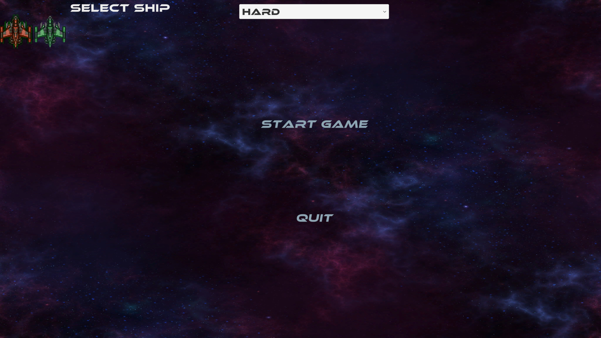
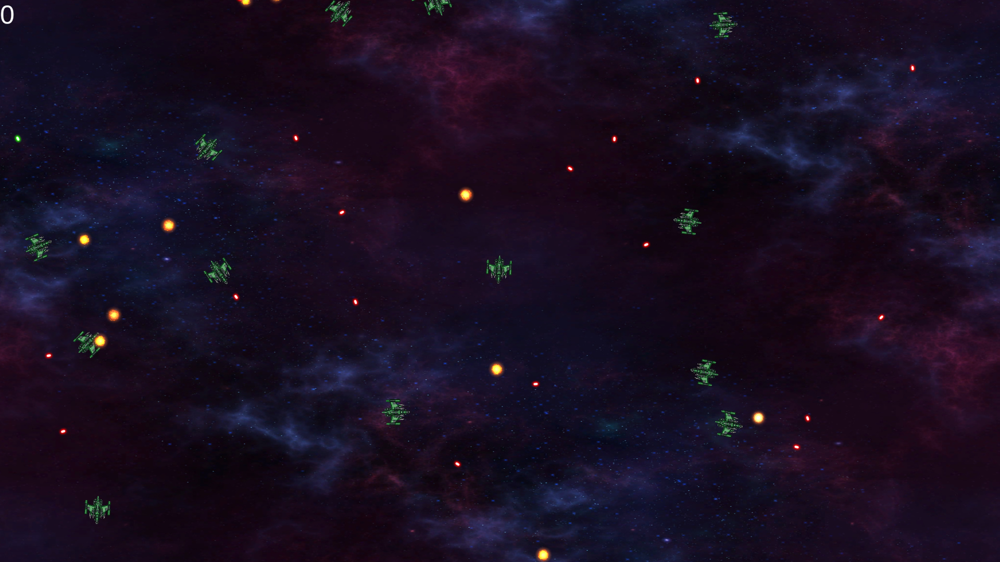
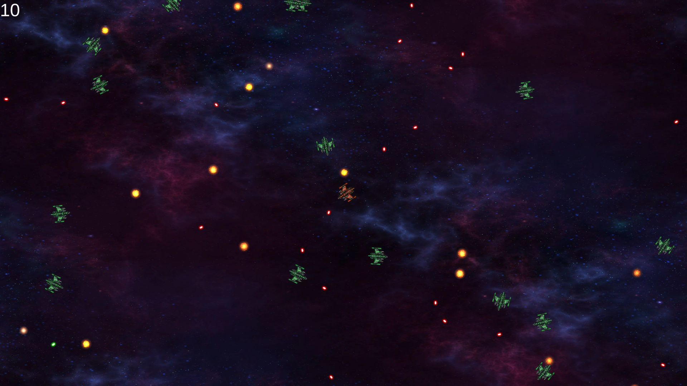
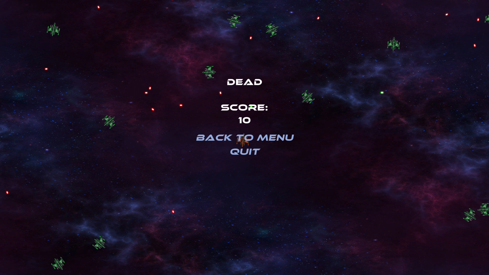
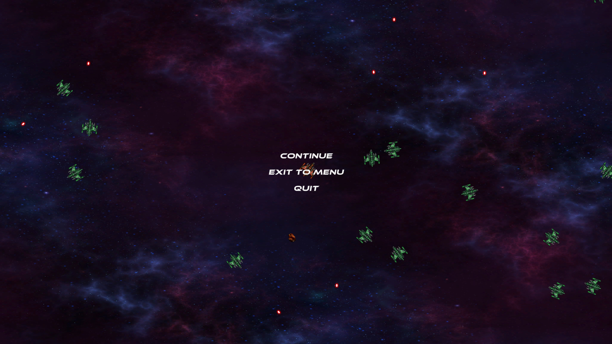

# Description
Asteroids like game made with [LeoEcs Lite](https://github.com/Leopotam/ecslite) framework. Custom physics, pure ecs in game logic, no MonoBehaviuors.

## MainMenu
Select ship, select difficulty, press start to play the game

## Gameplay
Shoot other ships or asteroids to earn score

If you take enough damage, you will lose and lose screen will appear

## Pause
Press Esc key to open pause menu

